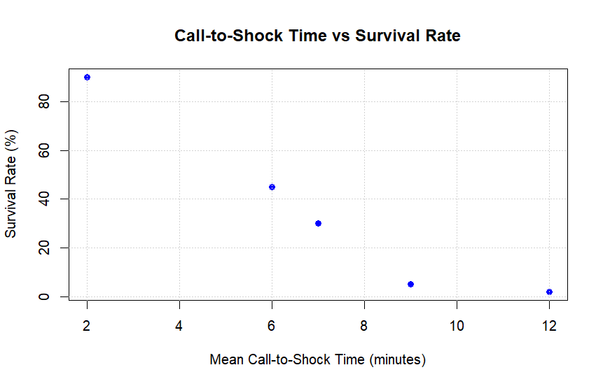

# Call-to-Shock Time and Survival Rate Analysis

This analysis explores the relationship between the mean call-to-shock time and survival rate based on the provided data.

## Data

The given data includes:

- **Mean Call-to-Shock Time (minutes)**: [2, 6, 7, 9, 12]
- **Survival Rate (%)**: [90, 45, 30, 5, 2]


## 1. Construct a Scatterplot

The scatterplot visualizes the relationship between the mean call-to-shock time and the survival rate.

```R
x <- c(2, 6, 7, 9, 12)  
y <- c(90, 45, 30, 5, 2)

plot(x, y, main = "Call-to-Shock Time vs Survival Rate",
     xlab = "Mean Call-to-Shock Time (minutes)", ylab = "Survival Rate (%)",
     pch = 19, col = "blue")
grid()

```




## 2. Calculate the equation of the least-squares line.

$$
Y= bX + a
$$


```

Residuals:
       1        2        3        4        5 
  7.2628  -0.5547  -6.2591 -12.6679  12.2190 

Coefficients:
            Estimate Std. Error t value Pr(>|t|)   
(Intercept)  [101.328]     12.392   8.177  0.00383 **
x            [-9.296]      1.564  -5.944  0.00952 **
---
Signif. codes:  0 ‘***’ 0.001 ‘**’ 0.01 ‘*’ 0.05 ‘.’ 0.1 ‘ ’ 1

Residual standard error: 11.58 on 3 degrees of freedom
Multiple R-squared:  0.9217,	Adjusted R-squared:  0.8957 
F-statistic: 35.34 on 1 and 3 DF,  p-value: 0.009519

```

### Equation :
$$
y= − 9.30x + 101.33
$$

## 3. Use the line to predict the survival rate for a call-to-shock time of 10 minutes.

Using the regression line :

```R

predicted_rate <- predict(model, data.frame(x = 10))
cat("Predicted rate:", round(predicted_rate, 2), "%\n")

```

### Predicted Survival Rate: ~8.37%
