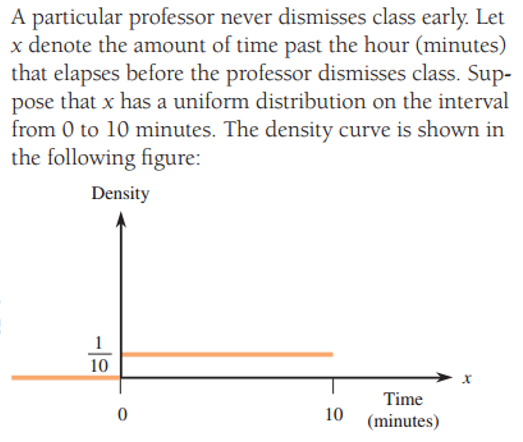
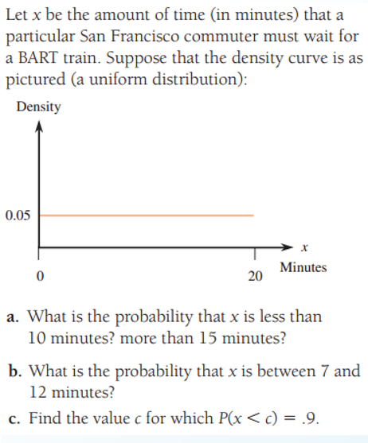

## 1. Professor Dismissal Time

$$
f(x) = \frac{1}{10}, \quad 0 \leq x \leq 10
$$

#### a. What is the probability that at most 5 minutes elapse before dismissal?

$$
P(x \leq 5) = (5 - 0) \times \frac{1}{10} = 0.5
$$

#### b. What is the probability that between 3 and 5 minutes elapse before dismissal?

The probability is the area under the density curve from $ 3 $ to $ 5 $:

$$
P(3 \leq x \leq 5) = (5 - 3) \times \frac{1}{10} = 0.2
$$

---

## BART Train Wait Time

$$
f(x) = 0.05, \quad 0 \leq x \leq 20
$$

#### a. What is the probability that $ x $ is less than 10 minutes? More than 15 minutes?

- **Less than 10 minutes**:

$$
P(x < 10) = (10 - 0) \times 0.05 = 0.5
$$

- **More than 15 minutes**:

$$
P(x > 15) = (20 - 15) \times 0.05 = 0.25
$$

#### b. What is the probability that $ x $ is between 7 and 12 minutes?

$$
P(7 \leq x \leq 12) = (12 - 7) \times 0.05 = 0.25
$$

#### c. Find the value of $ c $ for which $ P(x < c) = 0.9 $

$$
P(x < c) = (c - 0) \times 0.05 = 0.9
$$

$$
c = \frac{0.9}{0.05} = 18
$$

