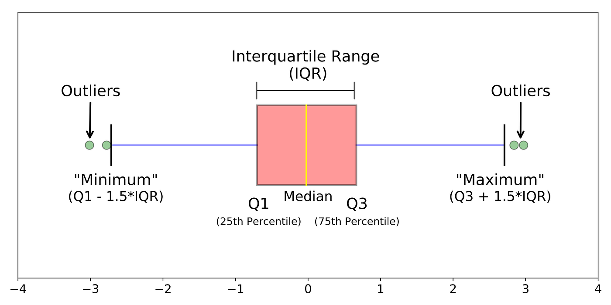

You have below dataset: 

$$
\text{32,35,45,40,32,50,52,33,38,46,49,41,55,60,42,29,31,34,36,39,48,53,44,37,51}
$$

Calculate Mean, Midean, Mod, IQR, Q1, Q3, Variance, Outlier, Z-score and Predict the shape of the distribution.

# Answer
## 1. Mean (Average)
The mean is the sum of all values divided by the number of values.

$$
\text{Mean} = \frac{\sum_{i=1}^{n} x_i}{n}
$$

Where:
- $x_i$ is each data point,
- $n$ is the number of data points.


$$
\text{Mean} = \frac{32+35+45+⋯+51}{25} = 42.08
$$


## 2. Median
The median is the middle value of the dataset when ordered from least to greatest. If the dataset has an even number of values, the median is the average of the two middle numbers.

1. order dataset form ascending
$$
\text{29,31,32,32,33,34,35,36,37,38,39,40,[41],42,44,45,46,48,49,50,51,52,53,55,60}
$$

The middle value is 41, so:

$$
\text{Median = 41}
$$

## 3. Mode
The mode is the most frequently occurring value in the dataset.

$$
\text{Mod = 41}
$$

## 4. First Quartile (Q1)
The first quartile is the median of the lower half of the dataset (25th percentile).

$$
Q1=35
$$

## 5. Third Quartile (Q3)
The third quartile is the median of the upper half of the dataset (75th percentile).

$$
Q3=49
$$

## 6. Interquartile Range (IQR)
The IQR is the range between the first quartile (Q1) and the third quartile (Q3).

$$
\text{IQR} = Q3 - Q1
$$

$$
\text{IQR} = 49 - 39 = 14
$$

## 7. Outliers
1. Outliers are data points that lie below the lower bound or above the upper bound, defined as:

$$
\text{Lower bound} = Q1 - 1.5 \times \text{IQR}
$$
$$
\text{Upper bound} = Q3 + 1.5 \times \text{IQR}
$$


Any value below the lower bound or above the upper bound is considered an outlier. For your dataset:

$$
\text{Lower bound} = 35−(1.5×14) = 14
$$
$$
\text{Upper bound} = 49+(1.5×14) = 70
$$

2. Or identify outlires visually using **Box Plot**



## 8. Variance
Variance measures the dispersion of the dataset. For a sample, it is calculated as:

$$
\text{Variance} = \frac{\sum_{i=1}^{n} (x_i - \bar{x})^2}{n - 1}
$$

Where:
- $x_i$ is each data point,
- $\bar{x}$ is the mean,
- $n$ is the number of data points.

## 9. Standard Deviation

Standard deviation is a statistical measurement that looks at how far individual points in a dataset are dispersed from the mean of that set. 

**Population Variance $\sigma^2$**:

$$
\sigma^2 = {\frac{\sum_{i=1}^{n} (x_i - \bar{x})^2}{n}}
$$

**Population Standard Deviation $\sigma$** :
$$
\sigma = \sqrt{\sigma^2}
$$
---
**Sample Variance $s^2$** :

*Uses n - 1 in the denominator (correction).*

$$
s^2 = {\frac{\sum_{i=1}^{n} (x_i - \bar{x})^2}{n - 1}}
$$
**Sample Standard Deviation $s$**: 
$$
s = \sqrt{s^2}
$$


Where:
- $\sigma$ Population Standard Deviation,
- $s$ Sample Standard Deviation,
- $\sigma^2$ Population Variance,
- $s^2$ Sample Variance,
- $x_i$ is each data point,
- $\bar{x}$ is the mean of the data,
- $n$ is the number of data points.

### Find Population Variance $\sigma^2$

1. Find the squared differences between each data point and the mean:
    ```
    (29 - 42)² = 169
    (31 - 42)² = 121
    (32 - 42)² = 100
    and so on...
    ```

2. Sum of squared differences:
    $$
    100 + 25 + 0 + 25 + 100 = 250
    $$

3. Divide by the number of data points:
    $$
    \sigma^2 = \frac{250}{5} = 50
    $$

4. Take the square root to get the standard deviation:
 $$
 Standard Deviation= \sqrt{Variance}
 $$

$$
\sigma = \sqrt{50} \approx 7
$$

## 9. Z-score
The Z-score represents the number of standard deviations a data point is from the mean.

$$
Z = \frac{x_i - \bar{x}}{\sigma}
$$

Where:
- $x_i$ is each data point,
- $\bar{x}$ is the mean,
- $\sigma$ is the standard deviation.

1. Find the mean $\bar{x}$ *(above)*: 
$$
Mean = 41
$$
2. Find the standard deviation (σ):


Lets calucalte z-score for 46 :

$$
Z = \frac{46 - 41}{\sigma}
$$
