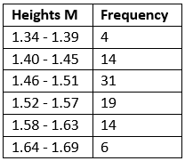
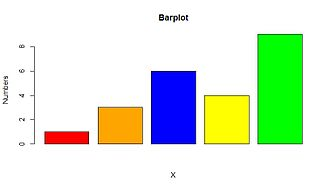
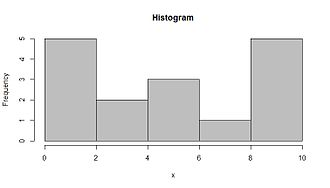
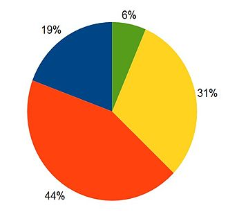

# Univariate Data
Univariate analysis is the simplest form of analyzing data. “Uni” means “one”, so in other words your data has only one variable.

### Examples :

| Monthly Sales Revenue (in thousands of dollars) |  
| ------------- |  
| 50, 55, 52, 60, 63, 65, 70, 68, 75, 72, 78, 80  | 

| Travel Time (minutes) |  
| ------------- |  
| 15, 29, 8, 42, 35, 21, 18, 42, 26  |

 
# Analytics Metrics 
Analytics metrics for univariate data focus on summarizing the central tendency, spread, and shape of the data distribution. These include:

### 1. Measures of Central Tendency:
- Mean: The average value of the data.
- Median: The middle value when data points are sorted.
- Mode: The most frequent value in the data set.
### 2. Measures of Dispersion (Spread):
- Range: The difference between the maximum and minimum values.
- Variance: The average of the squared differences from the mean.
- Standard Deviation: 
The square root of variance, indicating how much the data deviates from the mean.
- Interquartile Range (IQR): The range between the 25th - percentile (Q1) and the 75th percentile (Q3), useful for identifying the spread of the middle 50% of the data.
### 3. Measures of Shape:
Skewness: Describes the asymmetry of the distribution.
- Positive skew: Tail is on the right (longer tail on the positive side).
- Negative skew: Tail is on the left (longer tail on the negative side).

### 4. Other Metrics:
- Percentiles/Quantiles: Indicate the relative standing of a data point within the data set.
- Min/Max: The smallest and largest values in the data set.
- Frequency Distribution: Shows how often each value occurs in the data set, typically visualized as a histogram.
These metrics provide insights into the overall characteristics of the univariate data.

# Graphical methods

### 1. Frequency distribution tables

Frequency is how many times a number occurs. 

### 2. Bar charts

### 3. Histograms

### 4. Pie charts

