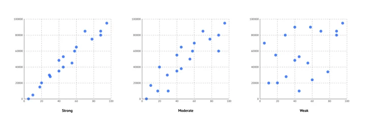

# Bivariate Data
 Bivariate Data refers to data that involves **two different variables**. This type of data is used to explore the **relationship** between two variables and analyze their **association or correlation**. 

### Examples :

This dataset representing the relationship between study hours and exam scores 

| Study Hours   | Exam Score |
| ------------- | ------------- |
| 2  | 50  |
| 4  | 60  |
| 6  | 80  |

This dataset contains two variables:

- Study Hours (independent variable)
- Exam Score (dependent variable)

### Types of Bivariate Analysis:
- Correlation (for numerical data): Measures the strength of the relationship between two variables.

- Chi-square test

# Analytics Metrics 
Analytics metrics for univariate data focus on summarizing the central tendency, spread, and shape of the data distribution. These include:

### 1. Correlation Coefficient (Pearson’s Correlation)
Measures the linear relationship between two numerical variables.
Range: From -1 to +1.
- +1 indicates a perfect positive correlation.
- -1 indicates a perfect negative correlation.
- 0 indicates no correlation.

### 2. Regression Analysis:
Examines how one variable (independent) affects another (dependent).

**Simple Linear Regression:** Used when one independent variable predicts one dependent variable.

*Example: Predicting exam score based on study hours.*

Regression Equation: 

$$
Y=a+bX
$$

where:

- $Y$ = dependent variable (exam score)
- $X$ = independent variable (study hours)
- $a$ = intercept
- $b$ = slope

### 3. R-squared (Coefficient of Determination)
R-squared measures the strength of the relationship between your linear model and the dependent variables

Range: 0 to 1, where 1 indicates a perfect fit.

*Example: How well study hours predict exam scores.*

# Graphical methods

### 1. Scatter Plot

 A visual representation to show the relationship between two numerical variables. 

