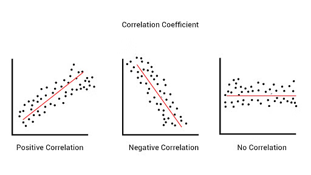
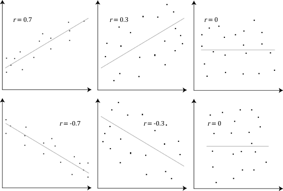
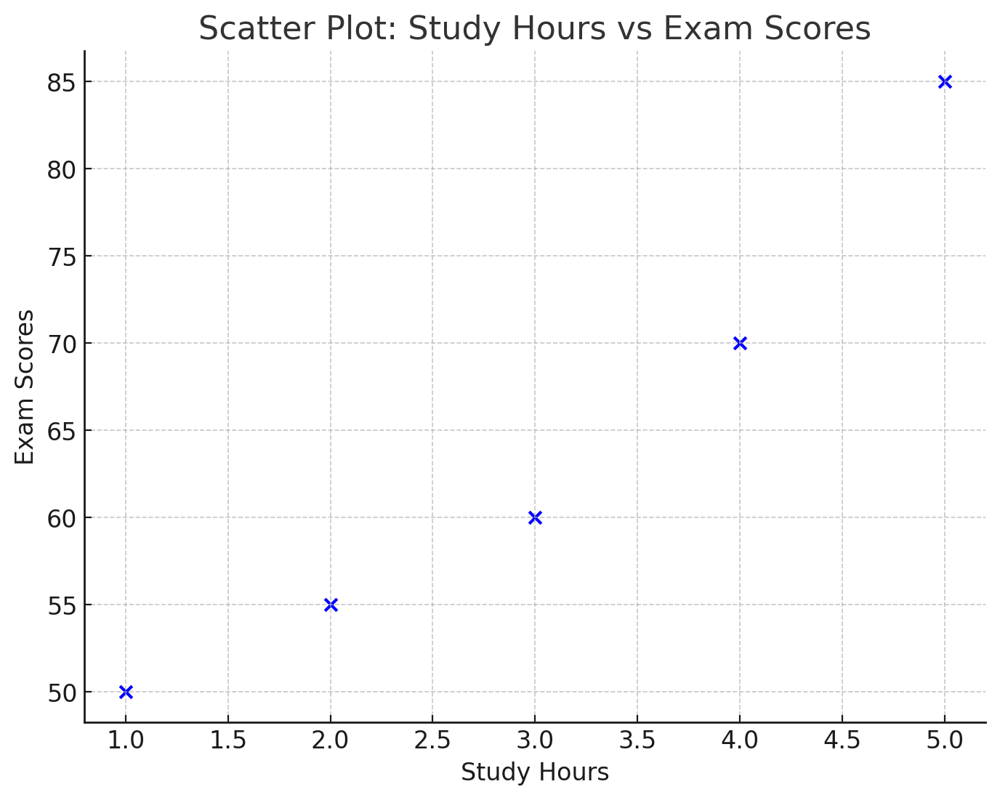

# Pearson's Correlation Coefficient     

It is a measure of the linear relationship between two continuous, numerical variables. It quantifies both the strength and the direction of the association between the variables.

$$
\text{r} = \frac{\sum (x_i - \bar x)(y_i - \bar y)}{\sqrt(\sum (x_i - \bar x)^2 \sum(y_i - \bar y))^2}
$$

Where:
- $x_i$ , $y_i$ are the individual data points for variables X and Y.
- $\bar x$, $\bar y$ are the means of variables x and y.

---

> [!IMPORTANT]  
> Correlation implies association, but not causation. 

#### Range: 

The value of Pearson's r ranges between -1 and +1.
- +1: Perfect positive correlation (as one variable increases, the other increases proportionally).
- 0: No correlation (no linear relationship between the variables).
- -1: Perfect negative correlation (as one variable increases, the other decreases proportionally).

#### Linear Relationship: 
Pearson's correlation only measures the strength of **a linear relationship**. If the relationship is non-linear, Pearson's correlation may not be appropriate.

## Example

You have the following dataset showing the number of hours spent practicing and the performance score in a test for 5 students. 

- 1) Analyze the relationship between the two variables.
- 2) Draw Scatter plot for the dataset

| Student   | Study Hours (X)   | Exam Score (Y) |
| ------------- | ------------- | ------------- |
1	| 2	|   55
2	| 3 |	60
3	| 1 |	50
4	| 4 |	70
5	| 5 |	85

### 1) Find r usng Pearson's Correlation

$$
\text{r} = \frac{\sum (x_i - \bar x)(y_i - \bar y)}{\sqrt(\sum (x_i - \bar x)^2 \sum(y_i - \bar y))^2}
$$

 

| Student | X (Study Hours) | Y (Exam Score) | Xᵢ - X̄ (Deviation of X) | Yᵢ - Ȳ (Deviation of Y) | (Xᵢ - X̄)(Yᵢ - Ȳ) |
|---------|-----------------|----------------|--------------------------|--------------------------|--------------------|
| 1       | 2               | 55             | 2 - 3 = -1               | 55 - 64 = -9             | -1 * -9 = 9        |
| 2       | 3               | 60             | 3 - 3 = 0                | 60 - 64 = -4             | 0 * -4 = 0         |
| 3       | 1               | 50             | 1 - 3 = -2               | 50 - 64 = -14            | -2 * -14 = 28      |
| 4       | 4               | 70             | 4 - 3 = 1                | 70 - 64 = 6              | 1 * 6 = 6          |
| 5       | 5               | 85             | 5 - 3 = 2                | 85 - 64 = 21             | 2 * 21 = 42        |
| **Sum** | **3**           |  **64**        |    **10**                | **770**                  | **85**             |

 

$$
\text{r} = \frac{85}{\sqrt(10)(770)} \approx 0.97
$$

#### r = 0.97, which indicates a strong positive correlation between study hours and exam scores. This means that as the study hours increase, exam scores tend to increase as well

### Scatter Plot: Study Hours Vs Exam Scores

