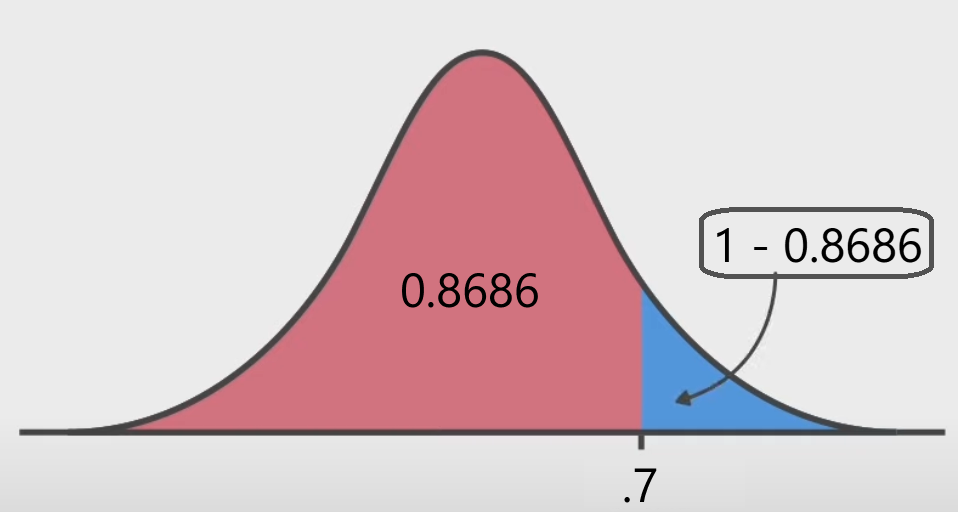

## **Chapter 8: Sampling Variability and Sampling Distributions**

## Book's queations

### **Q1: Explain the difference between a population characteristic and a statistic**

- **Answer:**  
  - A **population characteristic** is a value that describes a feature of the **entire population** (e.g., $ \mu, \sigma, p $).  
  - A **statistic** is a value calculated from a **sample of the population** and is used to estimate the population characteristic (e.g., $ \bar{x}, s, \hat{p} $).

---

### **Q2: What is the difference between $ \bar{x} $ and $ \mu $? Between $ s $ and $ \sigma $?**

> [!TIP]
> If the question contains  a **ALL** word, chose a population .

- **Answer:**  
  - $ \bar{x} $: Sample mean, calculated from **sample data**.  
    $ \mu $: Population mean, the true mean of the **entire population**.  
  - $ s $: Sample standard deviation, calculated from 
  88sample data**.  
    $ \sigma $: Population standard deviation, the true standard deviation of the **entire population**.

---

### **Q3: Identify whether the bold numbers represent a population characteristic or a statistic**

#### **a. 84% of all customers pay their bills on time.**  
- **Answer:** Population characteristic, as it refers to the entire population of customers.

#### **b. A sample of 100 students had a mean age of 24.1 years.**  
- **Answer:** Statistic, as it is based on a sample of students.

#### **c. The Department of Motor Vehicles reports that 22% of all vehicles registered in the state are imports.**  
- **Answer:** Population characteristic, as it describes the entire population of vehicles.

#### **d. A hospital reports a mean length of stay of 6.4 days based on 10 cases.**  
- **Answer:** Statistic, as it is based on a small sample of 10 cases.

#### **e. A consumer group reported an average life of 63 hours for 100 batteries.**  
- **Answer:** Statistic, as it is calculated from a sample of 100 batteries.

---

### Negative Z score table:
> https://www.ztable.net/

### **8.13: Suppose that a random sample of size 64 is selected from a population with mean 40 and standard deviation 5.**

#### **a. What are the mean and standard deviation of the $ \bar{x} $ sampling distribution? Describe the shape of the $ \bar{x} $ sampling distribution.**
- **Answer:**  
  - Mean of $ \bar{x} $: $ \mu_{\bar{x}} = \mu = 40 $  
  - Standard deviation of $ \bar{x} $: $ \sigma_{\bar{x}} = \frac{\sigma}{\sqrt{n}} = \frac{5}{\sqrt{64}} = 0.625 $  
  - Shape: Since the sample size ($ n = 64 $) is large, the sampling distribution of $ \bar{x} $ will be approximately normal, **according to the Central Limit Theorem**.

#### **b. What is the approximate probability that $ \bar{x} $ will be within 0.5 of the population mean $ \mu $?**
- **Answer:**  
  Using the standard normal distribution to find $P(\bar{x}=.5)$:

  - $ Z = \frac{0.5}{\sigma_{\bar{x}}} = \frac{0.5}{0.625} = 0.8 $  
  - Using the standard normal table, the probability for $ Z = 0.8 $ is approximately `0.7881`.  

  - Therefore, the probability that $ \bar{x} $ is within 0.5 of $ \mu $ is approximately $ 2 \times 0.7881 - 1 = 0.5762 $.

*The sample mean $ \bar{x} $ is within 0.5 of the population mean > $\mu$ that why we did last step above, meaning:*

> $ P(|\bar{x} - \mu| \leq 0.5) = P(\mu - 0.5 \leq \bar{x} \leq \mu + 0.5)$

#### **c. What is the approximate probability that $ \bar{x} $ will differ from $ \mu $ by more than 0.7?**
- **Answer:**  
We need to find $P(\bar{x}>.7)$:

  - $ Z = \frac{0.7}{\sigma_{\bar{x}}} = \frac{0.7}{0.625} = 1.12 $  
  - Using the standard normal table, the probability for $ Z = 1.12 $ is approximately `0.8686`.  
  - The probability that $ \bar{x} $ differs by more than $0.7$  is $ 1 - 0.8686 = 0.1314 $.

  

  *The  z-table, or standard normal table, tells the percentage of values that are less than a given z-score, so ween did substact z-score area  from $1$*

---

### **8.14: The time that a randomly selected individual waits for an elevator has a uniform distribution over the interval from 0 to 1 minute. For this distribution $ \mu = 0.5 $ and $ \sigma = 0.289 $.**

#### **a. Let $ \bar{x} $ be the sample mean waiting time for a random sample of 16 individuals. What are the mean and standard deviation of the sampling distribution of $ \bar{x} $?**
- **Answer:**  
  - Mean of $ \bar{x} $: $ \mu_{\bar{x}} = \mu = 0.5 $  
  - Standard deviation of $ \bar{x} $: $ \sigma_{\bar{x}} = \frac{\sigma}{\sqrt{n}} = \frac{0.289}{\sqrt{16}} = 0.07225 $

---

### **8.15: Let $ x $ denote the time (in minutes) that it takes a fifth-grade student to read a passage. Suppose $ \mu = 2 $ minutes and $ \sigma = 0.8 $ minutes.**

#### **a. If $ \bar{x} $ is the sample mean time for a random sample of $ n = 9 $ students, where is the $ \bar{x} $ distribution centered, and how much does it spread out around the center (as described by its standard deviation)?**
- **Answer:**  
  - The $ \bar{x} $ distribution is centered at $ \mu_{\bar{x}} = \mu = 2 $ minutes.  
  - The spread (standard deviation) is $ \sigma_{\bar{x}} = \frac{\sigma}{\sqrt{n}} = \frac{0.8}{\sqrt{9}} = 0.2667 $ minutes.

#### **b. Repeat Part (a) for a sample of size $ n = 20 $ and again for a sample of size $ n = 100 $. How do the centers and spreads of the three $ \bar{x} $ distributions compare to one another?**
- **Answer:**  
  - For $ n = 20 $:  
    - Center: $ \mu_{\bar{x}} = 2 $  
    - Spread: $ \sigma_{\bar{x}} = \frac{0.8}{\sqrt{20}} = 0.179 $  
  - For $ n = 100 $:  
    - Center: $ \mu_{\bar{x}} = 2 $  
    - Spread: $ \sigma_{\bar{x}} = \frac{0.8}{\sqrt{100}} = 0.08 $  
  - Comparison: The center ($ \mu_{\bar{x}} $) remains the same for all sample sizes, but the spread ($ \sigma_{\bar{x}} $) decreases as the sample size increases.

#### **c. Which of the sample sizes in Part (b) would be most likely to result in an $ \bar{x} $ value close to $ \mu $, and why?**
- **Answer:**  
  - The sample size $ n = 100 $ would be most likely to result in an $ \bar{x} $ value close to $ \mu $ because it has the smallest standard deviation ($ \sigma_{\bar{x}} = 0.08 $), indicating less variability in the sample mean.

---

## External queations

### **Q4:** What is the significance of sampling variability in statistics?  
- **Answer:** Sampling variability refers to the fact that the value of a sample statistic, such as the mean or proportion, **varies from sample to sample**. This variability is described by the sampling distribution.

---

### **Q5:** How does sample size affect the standard deviation of a sampling distribution?  
- **Answer:** As the **sample size increases**, the **standard deviation of the sampling distribution decreases**, leading to more precise estimates.

---
### **Q6:** When is the sampling distribution of the sample mean approximately normal?  
- **Answer:** The sampling distribution of the sample mean is approximately normal if the sample size $ n $ is large enough. 

*The Central Limit Theorem generally applies if $ n \geq 30 $, though smaller $ n $ might suffice if the population distribution is close to normal.*

### Let $ \bar{x} $ be the mean of a random sample of size 50 drawn from a population with mean 112 and standard deviation 40.

- a. Find the mean and standard deviation of $ \bar{x} $.
- b. Find the probability that $ \bar{x} $ assumes a value between 110 and 114.
- c. Find the probability that $ \bar{x} $ assumes a value greater than 113.

 
Answers:

### a. Find the mean and standard deviation of $ \bar{x} $.

  - Mean of $ \bar{x} $: $ \mu_{\bar{x}} = \mu = 112 $  
  - Standard deviation of $ \bar{x} $: $ \sigma_{\bar{x}} = \frac{\sigma}{\sqrt{n}} = \frac{40}{\sqrt{50}} = 5.65685 $
  
  ---

### b. Find the probability that $ \bar{x} $ assumes a value between 110 and 114.

1. **Standardize the values to calculate $ Z $-scores:**

   - For $ \bar{x} = 110 $:
     $$
     Z_1 = \frac{\bar{x} - \mu_{\bar{x}}}{\sigma_{\bar{x}}} = \frac{110 - 112}{5.657} \approx -0.354
     $$

   - For $ \bar{x} = 114 $:
     $$
     Z_2 = \frac{\bar{x} - \mu_{\bar{x}}}{\sigma_{\bar{x}}} = \frac{114 - 112}{5.657} \approx 0.354
     $$

2. **Find the probabilities from the standard normal distribution table:**
   - $ P(Z \leq -0.354) \approx 0.3616 $
   - $ P(Z \leq 0.354) \approx 0.6384 $

3. **Calculate the probability between 110 and 114:**
   $$
   P(110 \leq \bar{x} \leq 114) = P(Z \leq 0.354) - P(Z \leq -0.354)
   $$
   $$
   P(110 \leq \bar{x} \leq 114) = 0.6384 - 0.3616 = 0.2768
   $$

#### The probability that $ \bar{x} $ assumes a value between 110 and 114 is approximately **0.2768** or **27.68%**.

---

### **c. Find the probability that $ \bar{x} $ assumes a value greater than 113.**

1. **Standardize the value to calculate the $ Z $-score:**
   - For $ \bar{x} = 113 $:
     $$
     Z = \frac{\bar{x} - \mu_{\bar{x}}}{\sigma_{\bar{x}}} = \frac{113 - 112}{5.657} \approx 0.177
     $$

2. **Find the cumulative probability from the standard normal distribution table:**

   - $ P(Z \leq 0.177) \approx 0.5705 $

3. **Find the probability that $ \bar{x} > 113 $:**
   $$
   P(\bar{x} > 113) = 1 - P(Z \leq 0.177)
   $$
   $$
   P(\bar{x} > 113) = 1 - 0.5705 = 0.4295
   $$

#### The probability that $ \bar{x} $ assumes a value greater than 113 is approximately **0.4295** or **42.95%**.

