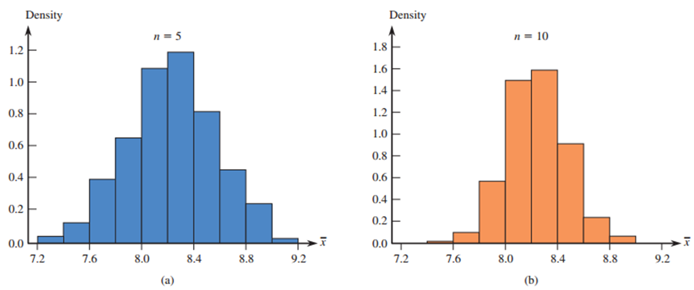
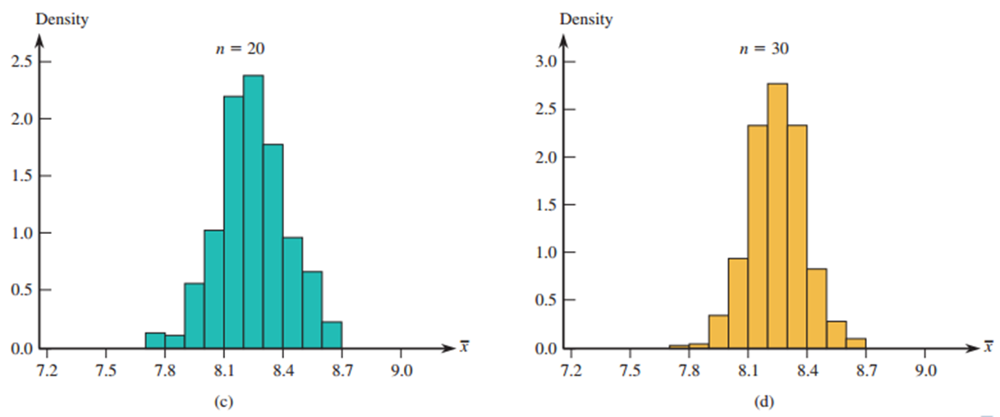
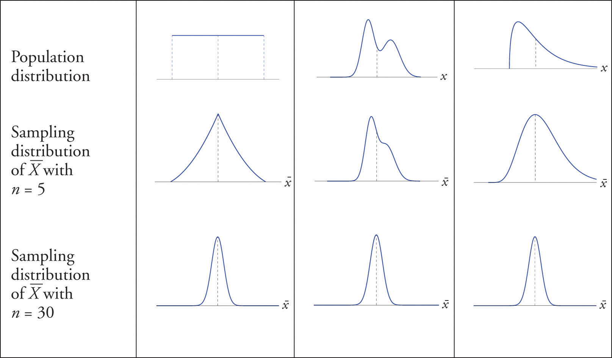

# Sampling Variability and Sampling Distributions

## Population, Sample, and Sampling Distribution:

---

### **Differences Between Population, Sample, and Sampling Distribution**

#### **1. Population**
- **Definition:** The entire group of individuals or items that we want to study or draw conclusions about.
- **Examples:** 
  - All students in a university.
  - All light bulbs manufactured in a factory.
- **Key Characteristics:**
  - Denoted by parameters like $ \mu $ (mean), $ \sigma $ (standard deviation), and $ p $ (proportion).
- **Disadvantages:**
  - Usually large and difficult to analyze directly.
  

#### **2. Sample**
- **Definition:** A subset of the population selected for study to draw conclusions about the entire population.
- **Examples:** 
  - 100 students randomly selected from the university.
  - A batch of 50 light bulbs chosen from production.
- **Key Characteristics:**
  - Denoted by statistics like $ \bar{x} $ (mean), $ s $ (standard deviation), and $ \hat{p} $ (proportion).
  - Used to make inferences about the population.
- **Disadvantages:**
  - Sampling may exclude some data that might not be homogenous to the data that are taken. **This affects the level of accuracy in the results.**

#### **3. Sampling Distribution**
- **Definition:** The probability distribution of a sample statistic (e.g., mean, proportion) calculated from **multiple samples** of the same size drawn from the population.
- **Examples:** 
  - The distribution of sample means ($ \bar{x} $) from repeated samples of size $ n $ drawn from a population.
- **Key Characteristics:**
  - Describes how a statistic (e.g., $ \bar{x} $ or $ \hat{p} $) varies across different samples.
  - Its shape depends on the sample size and the population distribution.
  - Often approximates a normal distribution if the sample size is large (Central Limit Theorem).

> [!TIP]
> The Central limit Theorem can safely be applied if n is greater than or equal to 30.

بمعنى أنه تكرار لعملية الـ sample ولكن بأخذ المتوسط مثلاً وكلما زاد عدد العينات كلما أعطى قيمة مقاربة للـ population.

---

### **The Sampling Distribution of a Sample Mean**

#### **Definition:**
- The sampling distribution of a sample mean is the probability distribution of the sample mean ($ \bar{x} $) calculated from all possible random samples of a given size ($ n $) drawn from a population.

ناخذ المتوسط لكل عينة

#### **Key Characteristics:**
1. **Mean of the Sampling Distribution:**
   - The mean of the sampling distribution ($ \mu_{\bar{x}} $) is equal to the population mean ($ \mu $).
   - $ \mu_{\bar{x}} = \mu $.

المتوسط له نفس المتوسط للـ population

2. **Standard Deviation of the Sampling Distribution:**
   - The standard deviation of the sampling distribution ($ \sigma_{\bar{x}} $) is called the standard error of the mean.
   - $ \sigma_{\bar{x}} = \frac{\sigma}{\sqrt{n}} $, where $ \sigma $ is the population standard deviation, and $ n $ is the sample size.
   - As the sample size increases, $ \sigma_{\bar{x}} $ decreases, resulting in more precise estimates.

3. **Shape of the Distribution:**
   - If the population distribution is normal, the sampling distribution of $ \bar{x} $ is also normal, regardless of the sample size.
   - If the population distribution is not normal, the sampling distribution of $ \bar{x} $ will be approximately normal if the sample size is large enough ($ n \geq 30 $) due to the **Central Limit Theorem**.

كلما زادت العينة أعطى تمثيل أفضل وقد تحسن توزيع الـ population

#### **Importance:**
- The sampling distribution of a sample mean is crucial for making inferences about the population mean ($ \mu $).
- It allows statisticians to estimate probabilities and construct confidence intervals for the population mean.

#### **Practical Example:**
- Suppose the average lifetime ($ \mu $) of light bulbs is 1000 hours with a standard deviation ($ \sigma $) of 100 hours.
- If random samples of size $ n = 25 $ are drawn, the standard error of the mean will be:
  $$
  \sigma_{\bar{x}} = \frac{\sigma}{\sqrt{n}} = \frac{100}{\sqrt{25}} = 20
  $$
- The sampling distribution of $ \bar{x} $ will have a mean of 1000 hours and a standard error of 20 hours.

---
