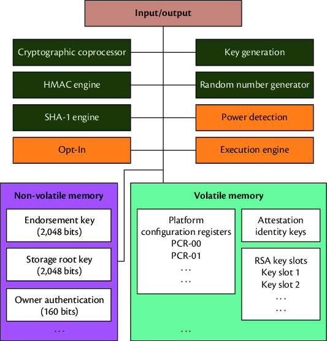

# General Instructions

## Problem Definition

We aim to investigate the performance characteristics of a Trusted Platform Module (TPM) by simulating its data-handling capabilities. The efficiency and reliability of a TPM can be predicted based on its attributes, such as file size, processing time, and type of operation.

### Trusted Platform Module (TPM)
Trusted Platform Module (TPM) is an international standard for a secure cryptoprocessor, a dedicated microcontroller designed to secure hardware through integrated cryptographic keys. 



for more info https://trustedcomputinggroup.org/about/what-is-a-trusted-platform-module-tpm/

### The investigation 

On a PC, either the Low Pin Count (LPC) bus or the Serial Peripheral Interface (SPI) bus is used to connect to the TPM chip.

>[!TIP]
> The theoretical maximum for the SPI clock is 25 MHz.


#### In this investigation, we are trying to study the possibility of relying on TPM in operations and when its services can not be used. By testing one function from TPM functions.

##  Gathering and Preparation Data

In order to collect data, the host device should have a TPM chip. However, I did simulate the whole process using a python server and client.

There are python scripts that simulate tpm functions in `misc` folder.

<details>

<summary>Running python</summary>

### Run server

1. Run server script :

```sh
   python tcp_server.py
```
This will create a local tcp server listinng on port `9999`, receives files then hash it and retuen hash value to the client.

2. Run client script:
```sh
   python tcp_client.py
```
The client try to connect to server.

3. Write your destination folder that contain files you want to test it. 

```sh
Enter the path to the folder containing files:
C:/myfolder/ # Your folder
```

</details>

<br/>

The dataset provided by tcp_client.py (file_processing_results.csv) contains the following key attributes:

- `File_Name:` Name of the processed file.
- `File_Type:` File extension/type.
- `File_Size:` File size in bytes.
- `Time_Taken:` Time taken for processing in seconds.
- `Hash_Value:` SHA-256 hash of the file.


## Descriptive Analysis

Perform a detailed summary of the data:

- Statistical metrics (mean, median, standard deviation) :

```
 | File_Size       |  Time_Taken      |
 | --------------- |------------------|
 | Min.   :    603 |  Min.   :0.00918 |  
 | 1st Qu.:   1360 |  1st Qu.:0.01005 |  
 | Median : 336414 |  Median :0.02520 |  
 | Mean   : 424957 |  Mean   :0.03857 |  
 | 3rd Qu.: 678456 |  3rd Qu.:0.05415 |  
 | Max.   :1476380 |  Max.   :0.13909 |  
```

- Distribution of file type :


## Relationships Between Attributes

Correlation between File Size and Time Taken: `0.96` 

```sh
correlation <- cor(data$File_Size, data$Time_Taken)
```

Scatterplot to visualize relationship between File_Size and Time_Taken:


The scatterplot indicates a strong positive relationship between file size and time taken.


## Build a predictive model 

We will build a linear regression model to predict the time taken for hashing files.

```sh
model <- lm(Time_Taken ~ File_Size, data = data)
```

Summarize the model output:

```
Call:
lm(formula = Time_Taken ~ File_Size, data = train_data)

Residuals:
      Min        1Q    Median        3Q       Max 
-0.016273 -0.008143  0.005540  0.006942  0.012546 

Coefficients:
             Estimate Std. Error t value Pr(>|t|)    
(Intercept) 3.001e-03  4.054e-03    0.74    0.476    
File_Size   8.368e-08  6.558e-09   12.76 1.64e-07 ***
---
Signif. codes:  0 ‘***’ 0.001 ‘**’ 0.01 ‘*’ 0.05 ‘.’ 0.1 ‘ ’ 1

Residual standard error: 0.01005 on 10 degrees of freedom
Multiple R-squared:  0.9421,	Adjusted R-squared:  0.9364
```

*The linear regression model achieved an R-squared value of 0.878, approximately 88% of the variance in the time taken to hash a file is explained by the file size variables.*

### Visualization of actual vs predicted values:


### 

we will predict the time taken for hashing a file with a size of 1GB (1,073,741,824 bytes) using our model

```sh
file_size_1GB <- data.frame(File_Size = 1073741824) # 1GB
predicted_time_1GB <- predict(model, file_size_1GB)

cat("Predicted Time Taken for a 1 GB file:", predicted_time_1GB, "seconds\n")
```

**Predicted Time Taken for a 1 GB file: `89.85259 seconds`.**


## Conclusion

Based on our analysis, when we made a prediction using the model, it gave a result of waiting more than a minute to process the large file, which shows that we do not rely on the unit to process large files and find an alternative way so that the system does not slow down.

- A TPM (Trusted Platform Module) is used to improve the security of PCs / Servres.

- Fully relying on TPM can slow some operations.

- Using hybrid system can achieve security and efficiency.