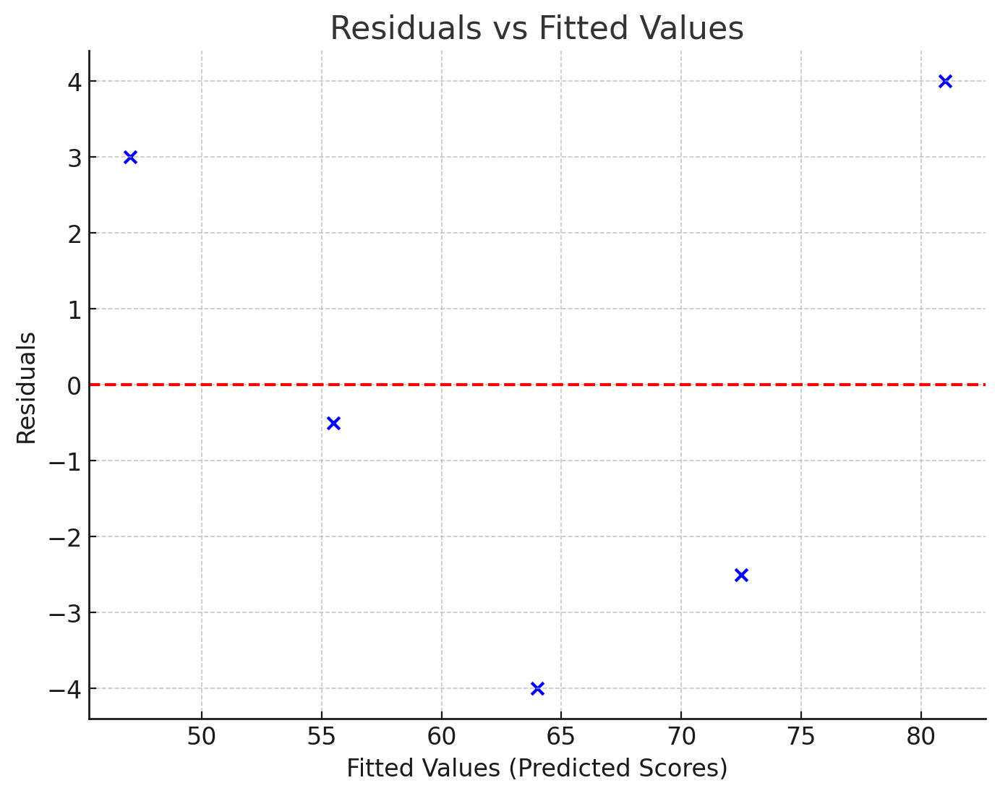

# Residual analysis

Residual analysis is an essential step in evaluating how well a regression model fits the data. The residual for each observation is the difference between the observed value and the predicted value made by the regression model:

$$
Residual = 𝑌𝑖 − 𝑌^𝑖​
$$

 
Where:

- $𝑌𝑖$ is the actual value.
- $𝑌^𝑖$ is the predicted value from the regression equation.

## Example 

We will use last example the dataset about study hours and exam scores to evaluate the regression modle. 

1) Regression model:

$$
Y=38.5+8.5X
$$

- Residuals Calculation Table:

| Student | X (Study Hours) | Y (Actual Exam Score) | ( $\hat{Y}$ ) (Predicted Score) | Residual \( $Y_i - \hat{Y}_i$ \) |
|---------|-----------------|-----------------------|---------------------------------|-------------------------------|
| 1       | 2               | 55                    | 38.5+8.5(2)=55.5        | 55 - 55.5 = -0.5                      |
| 2       | 3               | 60                    | 38.5+8.5(3)=64.0        | 60 - 64.0 = -4.0                      |
| 3       | 1               | 50                    | 38.5+8.5(1)=47.0        | 50 - 47.0 = 3.0                       |
| 4       | 4               | 70                    | 38.5+8.5(4)=72.5        | 70 - 72.5 = -2.5                      |
| 5       | 5               | 85                    | 38.5+8.5(5)=81.0        | 85 - 81.0 = 4.0                       |

-  Residuals (Errors) Table:

| Student | Residual (  $Y_i - \hat{Y}_i$  ) |
|---------|------------------------------------|
| 1       | -0.5                              |
| 2       | -4.0                              |
| 3       | 3.0                               |
| 4       | -2.5                              |
| 5       | 4.0                               |

2) Plot Residuals:

#### This analysis confirms that the linear regression model fits the data reasonably well and can be used for predictions:

- **Randomly Scattered Residuals**
- **No Obvious Patterns**